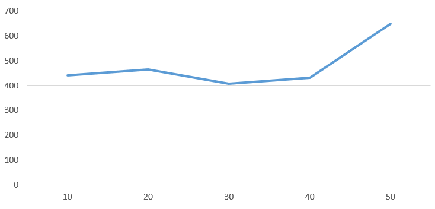
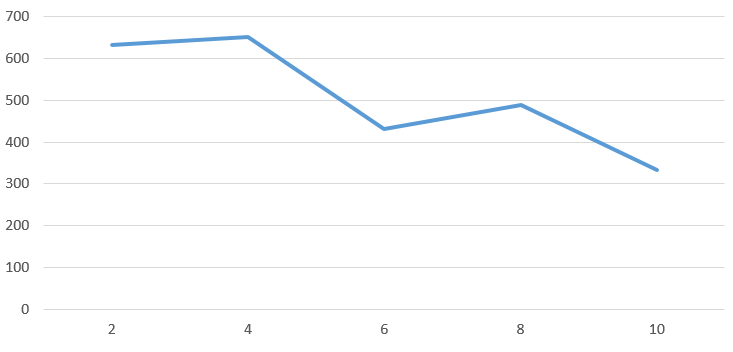

## Комп'ютерні системи імітаційного моделювання
## СПм-24-1, **Чередниченко Ігор Сергійович**
### Лабораторна робота №**1**. Опис імітаційних моделей та проведення обчислювальних експериментів

 

### Варіант 7, модель у середовищі NetLogo:
[Wolf Sheep Predation](http://www.netlogoweb.org/launch#http://www.netlogoweb.org/assets/modelslib/Sample%20Models/Social%20Science/Traffic%20Basic.nlogo) Модель взаємоіснування хижаків та їх жертв.

 

### Вербальний опис моделі:
Модель імітує динаміку популяцій хижаків (вовків) та їхніх жертв (овець) у межах замкнутого середовища з обмеженими ресурсами, відтворюючи основні процеси екологічної системи «хижак–жертва». Кожен агент діє за певними правилами: вівці рухаються середовищем у пошуках їжі (трави) та розмножуються, тоді як вовки полюють на овець для виживання і гинуть за відсутності здобичі.

### Керуючі параметри:
- **grass-regrowth-time** час, необхідний для відновлення трави після того, як її з’їли вівці;
- **initial-number-sheep** початкова кількість овець у популяції;
- **initial-number-wolves** початкова кількість вовків у популяції;
- **sheep-gain-from-food** кількість енергії, яку отримує вівця після споживання трави;
- **wolf-gain-from-food** кількість енергії, яку отримує вовк після поїдання вівці;
- **sheep-reproduce** імовірність розмноження овець при кожному кроці моделювання;
- **wolf-reproduce** імовірність розмноження вовків при кожному кроці моделювання.

### Внутрішні параметри:
- **max-sheep**. Не дозволяє популяції овець занадто сильно зростати.

### Показники роботи системи:
- мінімальна та максимальна кількість овець за час симуляції;
- мінімальна та максимальна кількість вовків за час симуляції;
- пік популяції вовків - максимальна кількість хижаків, досягнута після періоду зростання популяції овець;
- середня кількість трави на полі як показник доступності кормової бази для жертв;
- кількість вимирань - фіксація моментів, коли популяція овець або вовків падає до нуля;
- стабільність екосистеми - період часу, протягом якого в системі одночасно існують обидва види (вовки та вівці) без повного вимирання одного з них;
- фаза циклу "хижак-жертва" - момент, коли кількість вовків перевищує кількість овець, що свідчить про перехід до наступної фази циклу.

### Алгоритм зміни станів моделі:
Існує дві основні варіації цієї моделі.

У першому варіанті, версії «вівці-вовки», вовки та вівці випадково блукають ландшафтом, поки вовки шукають овець для полювання. Кожен крок коштує вовкам енергії, і вони повинні їсти овець, щоб поповнити свою енергію — коли у них закінчується енергія, вони гинуть. Щоб популяція могла продовжуватися, кожен вовк або вівця має фіксовану ймовірність розмноження на кожному кроці часу. У цьому варіанті ми моделюємо траву як «нескінченну», щоб вівці завжди мали достатньо їжі, і ми не моделюємо явно поїдання або зростання трави. Таким чином, вівці не отримують і не втрачають енергію, їдячи або рухаючись. Цей варіант створює цікаву динаміку популяції, але зрештою є нестабільним.

Другий варіант, версія "вівці-вовки-трава", явним чином моделює траву (зелений колір) окрім вовків та овець. Поведінка вовків є ідентичною до першого варіанту, однак цього разу вівці повинні їсти траву, щоб підтримувати свою енергію — коли в них закінчується енергія, вони гинуть. Як тільки траву з'їдено, вона відросте лише через фіксований проміжок часу. Цей варіант є складнішим за перший, але він є загалом стабільним. Він більше відповідає класичним моделям популяційних коливань Лотки-Вольтерри. Хоча класичні моделі Лотки-Вольтерри припускають, що популяції можуть набувати дійсних значень, але для малих популяцій ці моделі недооцінюють вимирання, і агентні моделі, такі як представлені тут, дають більш реалістичні результати.

### Недоліки моделі:
- У реальних екосистемах хвороби є потужним екологічним фактором, який може кардинально впливати на динаміку популяцій "хижак-жертва". Їхня відсутність у моделі спрощує систему та може створювати нереалістично стабільні або передбачувані цикли.
- Модель не враховує кліматичні зміни, втручання людини чи конкуренцію з іншими видами, що є важливими в реальних екосистемах.
- Обмежена прогностична здатність. Модель добре ілюструє загальні принципи, але її важко використовувати для точного прогнозування реальних популяцій через велику кількість спрощень.

 

## Обчислювальні експерименти
### 1. Вплив швидкості відростання трави на максимальну популяцію овець
Досліджується доступність основного ресурсу для жертв (трави) впливає на пікову чисельність їхньої популяції.
Джерелом енергії для овець є трава. Швидкість її відновлення безпосередньо визначає, скільки овець може прогодувати екосистема. Проводиться 5 симуляцій, де параметр **grass-regrowth-time** змінюється від 10 до 50 з кроком 10. Для кожного запуску фіксується максимальна кількість овець, зареєстрована за весь час симуляції.
Керуючі параметри мають такі значення:
- **initial-number-sheep** = 100;
- **initial-number-wolves** = 50;
- **grass-regrowth-time** = 10-50 (змінний параметр);
- **sheep-gain-from-food** = 4;
- **wolf-gain-from-food** = 20;
- **sheep-reproduce** = 4%;
- **wolf-reproduce** = 5%.
- Час симуляції: 200 тактів.

<table>
<thead>
<tr><th>Швидкість відновлення трави</th><th>Максимальна кількість овець</th></tr>
</thead>
<tbody>
<tr><td>10</td><td>441</td></tr>
<tr><td>20</td><td>464</td></tr>
<tr><td>30</td><td>407</td></tr>
<tr><td>40</td><td>431</td></tr>
<tr><td>50</td><td>648</td></tr>
</tbody>
</table>

Графік наочно показує, що не спостерігається прямої лінійної залежності між швидкістю відновлення трави та максимальною кількістю овець. Замість цього дані демонструють нелінійну залежність з чітко вираженим різким зростанням при швидкості відновлення 50.

### 2. Вплив ймовірності розмноження вовків на максимальну популяцію хижаків
Досліджується залежність пікової чисельності популяції вовків від частоти їхнього розмноження.
Швидкість відтворення популяції хижаків є ключовим фактором, що визначає їхню динаміку. Цей експеримент досліджує, як зміна ймовірності розмноження вовків (wolf-reproduce) впливає на максимальну чисельність, якої вони можуть досягти. Проводиться 5 симуляцій, де параметр **wolf-reproduce** змінюється від 2% до 10% з кроком 2%. Для кожного запуску фіксується максимальна кількість вовків, зареєстрована за весь час симуляції.
Керуючі параметри мають такі значення:
- **initial-number-sheep** = 100;
- **initial-number-wolves** = 50;
- **grass-regrowth-time** = 30; 
- **sheep-gain-from-food** = 4;
- **wolf-gain-from-food** = 20;
- **sheep-reproduce** = 4%;
- **wolf-reproduce** = 2-10%(змінний параметр);.
- Час симуляції: 200 тактів.

<table>
<thead>
<tr><th>Ймовірність розмноження вовків</th><th>Максимальна кількість вовків</th></tr>
</thead>
<tbody>
<tr><td>2</td><td>632</td></tr>
<tr><td>4</td><td>651</td></tr>
<tr><td>6</td><td>431</td></tr>
<tr><td>8</td><td>489</td></tr>
<tr><td>10</td><td>332</td></tr>
</tbody>
</table>

Графік наочно показує, що збільшення ймовірності розмноження вовків не призводить до стабільного зростання їх максимальної популяції, а демонструє складну нелінійну залежність з оптимальним діапазоном. У діапазоні ймовірності розмноження від 2% до 4% спостерігаються найвищі значення максимальної популяції вовків (632-651 особин). Це вказує на збалансованість системи, де хижаки ефективно контролюють популяцію овець без швидкого виснаження кормової бази.

### 3. Визначення критичного рівня енергії, отриманої вовком від їжі, для виживання популяції вовків
Досліджується залежність факту вимирання вовків від енергетичної "ефективності полювання".
Параметр **wolf-gain-from-food** визначає, скільки енергії отримує вовк за кожну з'їдену вівцю. Це впливає на те, як часто вовк має полювати, щоб вижити і дати потомство. Проводиться 5 симуляцій, де параметр змінюється від 15 до 35 з кроком 5. Фіксується факт вимирання вовків: Так або Ні (з кількістю осіб) протягом 300 тактів.
Керуючі параметри мають такі значення:
- **initial-number-sheep** = 100;
- **initial-number-wolves** = 50;
- **grass-regrowth-time** = 30; 
- **sheep-gain-from-food** = 4;
- **wolf-gain-from-food** = 15-35;(змінний параметр);
- **sheep-reproduce** = 4%;
- **wolf-reproduce** = 5%.
- Час симуляції: 300 тактів.

<table>
<thead>
<tr><th>Енергія за кожну з'їдену вівцю</th><th>Факт вимирання вовків</th></tr>
</thead>
<tbody>
<tr><td>15</td><td>Ні (43)</td></tr>
<tr><td>20</td><td>Так</td></tr>
<tr><td>25</td><td>Ні (28)</td></tr>
<tr><td>30</td><td>Ні (142)</td></tr>
<tr><td>35</td><td>Ні (223)</td></tr>
</tbody>
</table>

Графік наочно показує, що не спостерігається прямої лінійної залежності між швидкістю відновлення трави та максимальною кількістю овець. Замість цього дані демонструють нелінійну залежність з чітко вираженим різким зростанням при швидкості відновлення 50.

