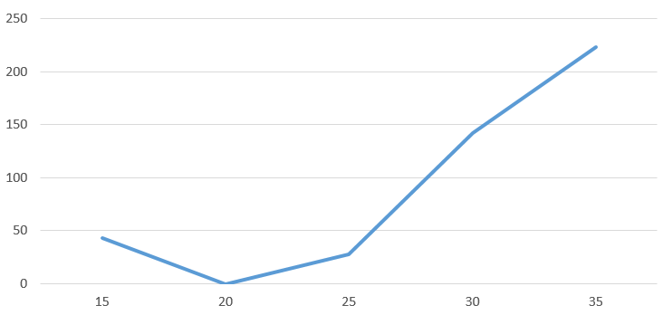

# Комп'ютерні системи імітаційного моделювання
## СПм-24-1, **Чередниченко Ігор Сергійович**
## Лабораторна робота №2. Редагування імітаційних моделей у середовищі NetLogo

 

### 2.1 Мета роботи
Отримати уявлення про синтаксис та можливості мови мультиагентного імітаційного моделювання NetLogo.  
Навчитися вносити зміни до вихідного коду готових моделей з різних предметних областей, які пропонуються середовищем NetLogo.

 

### 2.2 Порядок виконання роботи
Лабораторна робота полягає у корекції внутрішньої логіки зміни стану тієї самої моделі, з якою вже ознайомилися під час виконання попередньої лабораторної, що була присвячена [опису імітаційних моделей](..\Simulation_Lab1\tutorial.md). Тепер необхідно:
1. Сумлінно **ознайомитись** з вихідним кодом, що описує логіку зміни стану моделі. У веб-версії NetLogo код доступний у секції "NetLogo Code".
2. **Внести зміни** у логіку роботи моделі, згідно **варіанту**. 
3. **Внести зміни** у логіку роботи моделі, згідно **власного розсуду**. Пам'ятайте, що реалізація змін не повинна порушувати загальну логіку моделі та призводити до її неадекватності об'єкту імітаційного моделювання.
4. Провести **обчислювальний експеримент**, на власний вибір, за аналогією з вже проведеними дослідженнями з відповідної [лабораторної](..\Simulation_Lab1\tutorial.md). Достатньо одного експерименту, що продемонструє, як зміна логіки вплинула на характер **залежності** показників роботи моделі від керуючих параметрів.
5. Підготувати (у форматі md) **опис внесених змін моделі та проведеного обчислювального експерименту**. Репозиторій, окрім цього опису, повинен містити також **nlogo-файл** редагованої моделі, який можна отримати шляхом експорту у веб-версії (якщо усі внесені зміни не передбачали роботи з інтерфейсом користувача), або при збережені зміненої моделі при використанні десктопної версії NetLogo.

### 2.3 Варіанти завдань
Наведено перелік моделей (варіанти співпадають із тими, що були на лабораторній роботі, яка присвячена опису та використанню моделей) та необхідні зміни. Зверніть увагу, що, згідно пункту 3 у розділі 2.3, окрім описаних змін, необхідно додати також щось своє, на власний розсуд.  
Модель для роботи обирається згідно свого варіанту, **вказаним викладачем**.  
### Варіант 7, модель у середовищі NetLogo:
[Wolf Sheep Predation](http://www.netlogoweb.org/launch#http://www.netlogoweb.org/assets/modelslib/Sample%20Models/Social%20Science/Traffic%20Basic.nlogo) Модель взаємоіснування хижаків та їх жертв. Прибрати "зграйність" вовків - тепер перед початком свого ходу вовки повинні "оглядатися", перевіряючи оточення, та обирати напрямок руху виходячи з наявності вівець та відсутності інших вовків. Якщо немає іншої можливості – переміщається випадково. При знаходженні на одній ділянці поля двох вовків залишається лише один з них. Вівці переміщаються випадковим чином, але при виявленні вовка на одній із клітин поруч змінюють напрямок на протилежний.

### Внесені зміни у вихідну логіку моделі, за варіантом:
Прибрано "зграйність" вовків та додано "оглядання".
<pre>
  to move-wolf
  let best-patch nobody
  let max-score -1
  
  ; Look around at neighboring patches
  ask neighbors [
    let sheep-here-count count sheep-here
    let wolves-here-count count wolves-here
    let score (sheep-here-count * 2) - (wolves-here-count * 3)
    
    if score > max-score and sheep-here-count > 0 [
      set max-score score
      set best-patch self
    ]
  ]
</pre>

Вовки оцінюють сусідні клітини за системою балів:
* +2 бали за кожну вівцю;
* -3 бали за кожного вовка;
* Рухаються до найкращої доступної клітини.

Конкуренція між вовками на одній клітині
<pre>
ask patches with [count wolves-here > 1] [
  let wolf-pack wolves-here
  let strongest max-one-of wolf-pack [energy]
  ask wolf-pack [ if self != strongest [ die ] ]
]
</pre>
У результаті залишається тільки найсильніший вовк (з найбільшою енергією)

Реалізовано уникнення хижаків вівцями
<pre>
  to move-sheep
  let wolf-nearby? false
  let wolf-direction 0
  
  ask neighbors [
    if any? wolves-here [
      set wolf-nearby? true
      set wolf-direction towards myself
    ]
  ]
  
  if wolf-nearby? [
    set heading (wolf-direction + 180) mod 360
    fd 1
    stop
  ]
</pre>
Вівці тікають у протилежному напрямку при виявленні вовка поруч

Також на власний розсуд було додано розмежування на самців та самок
<pre>
  turtles-own [ 
  gender  ; 0 = female, 1 = male
]

to update-appearance-by-gender
  ifelse breed = sheep [
    ifelse gender = 0 [
      set color white  ; females
    ]
    [
      set color yellow  ; males
    ]
  ]
  [
    ifelse gender = 0 [
      set color 35  ; dark gray for female wolves
    ]
    [
      set color black  ; black for male wolves
    ]
  ]
end
</pre>

А також додано реалістичне розмноження вівець з урахування статі:
<pre>
  let potential-mates sheep-here with [gender != [gender] of myself]
</pre>

### Виконаємо дослідження: "Визначення критичного рівня енергії, отриманої вовком від їжі, для виживання популяції вовків"  
Досліджується залежність факту вимирання вовків від енергетичної "ефективності полювання".
Параметр **wolf-gain-from-food** визначає, скільки енергії отримує вовк за кожну з'їдену вівцю. Це впливає на те, як часто вовк має полювати, щоб вижити і дати потомство. Проводиться 5 симуляцій, де параметр змінюється від 15 до 35 з кроком 5. Фіксується факт вимирання вовків: Так або Ні (з кількістю осіб) протягом 300 тактів.
Керуючі параметри мають такі значення:
- **initial-number-sheep** = 100;
- **initial-number-wolves** = 50;
- **grass-regrowth-time** = 30; 
- **sheep-gain-from-food** = 4;
- **wolf-gain-from-food** = 15-35;(змінний параметр);
- **sheep-reproduce** = 4%;
- **wolf-reproduce** = 5%.
- Час симуляції: 300 тактів.

<table>
<thead>
<tr><th>Енергія за кожну з'їдену вівцю</th><th>Факт вимирання вовків</th></tr>
</thead>
<tbody>
<tr><td>15</td><td>Ні (43)</td></tr>
<tr><td>20</td><td>Так</td></tr>
<tr><td>25</td><td>Ні (28)</td></tr>
<tr><td>30</td><td>Ні (142)</td></tr>
<tr><td>35</td><td>Ні (223)</td></tr>
</tbody>
</table>

