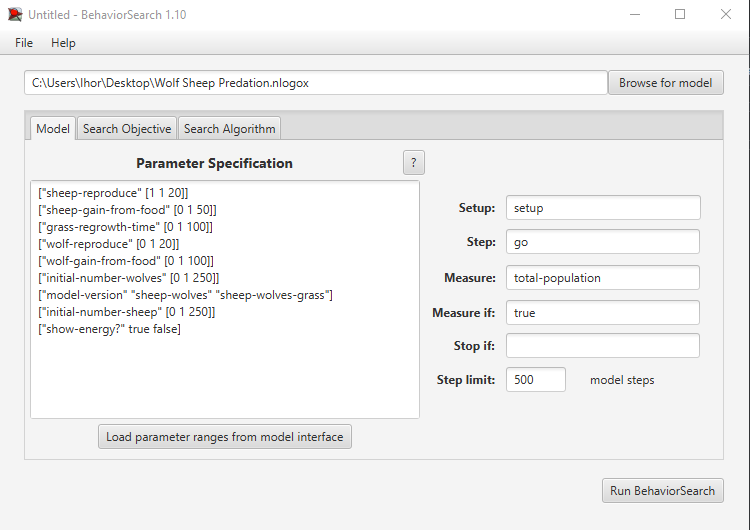
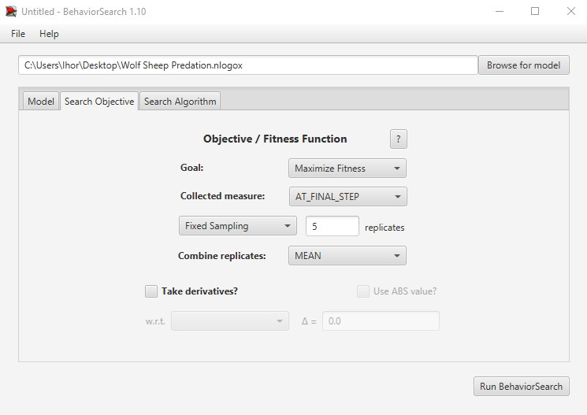
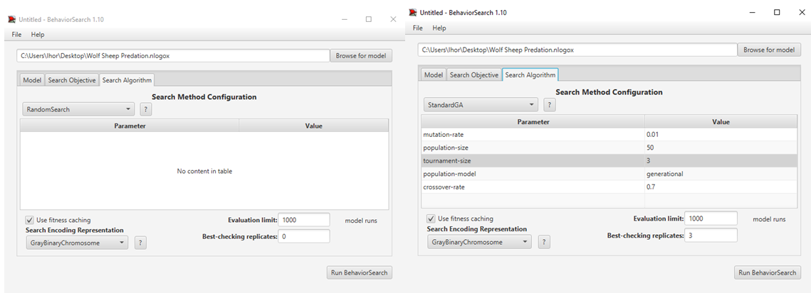
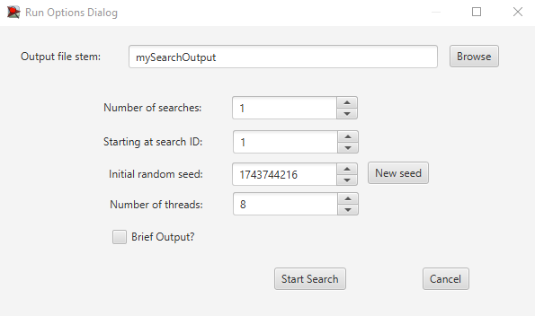
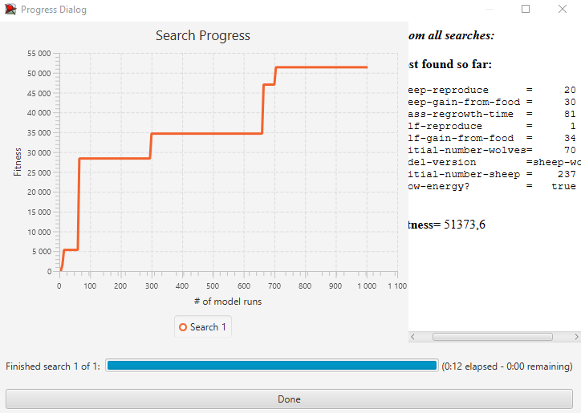
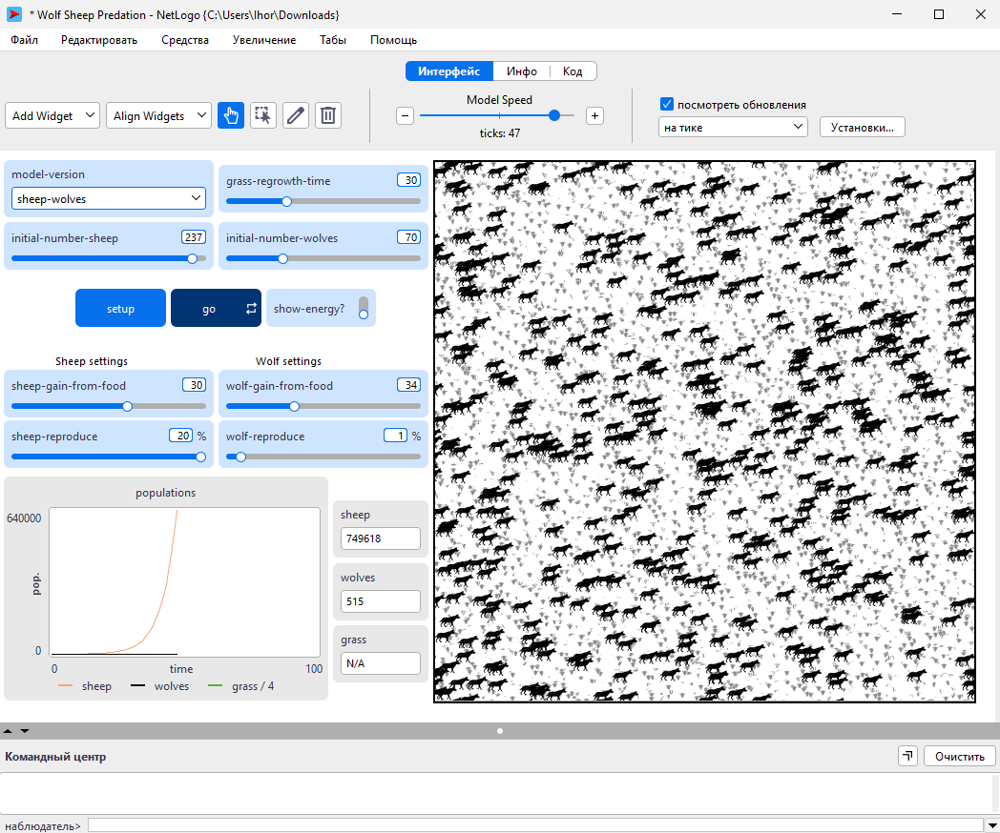
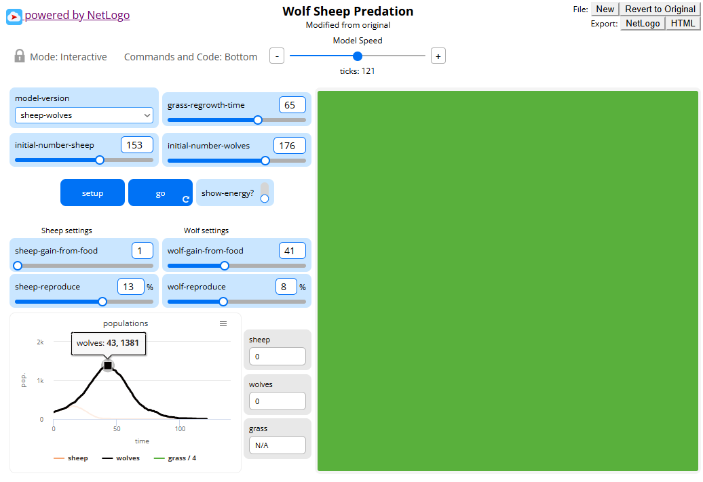

## Комп'ютерні системи імітаційного моделювання
## СПм-24-1, **Чередниченко Ігор Сергійович**
### Лабораторна робота №**3**. Використання засобів обчислювального інтелекту для оптимізації імітаційних моделей

 

### Варіант 7, модель у середовищі NetLogo:
[Wolf Sheep Predation](http://www.netlogoweb.org/launch#http://www.netlogoweb.org/assets/modelslib/Sample%20Models/Social%20Science/Traffic%20Basic.nlogo) Модель взаємоіснування хижаків та їх жертв.

 

### Вербальний опис моделі:
Модель імітує динаміку популяцій хижаків (вовків) та їхніх жертв (овець) у межах замкнутого середовища з обмеженими ресурсами, відтворюючи основні процеси екологічної системи «хижак–жертва». Кожен агент діє за певними правилами: вівці рухаються середовищем у пошуках їжі (трави) та розмножуються, тоді як вовки полюють на овець для виживання і гинуть за відсутності здобичі.

### Керуючі параметри:
- **grass-regrowth-time** час, необхідний для відновлення трави після того, як її з’їли вівці;
- **initial-number-sheep** початкова кількість овець у популяції;
- **initial-number-wolves** початкова кількість вовків у популяції;
- **sheep-gain-from-food** кількість енергії, яку отримує вівця після споживання трави;
- **wolf-gain-from-food** кількість енергії, яку отримує вовк після поїдання вівці;
- **sheep-reproduce** імовірність розмноження овець при кожному кроці моделювання;
- **wolf-reproduce** імовірність розмноження вовків при кожному кроці моделювання.

### Внутрішні параметри:
- **max-sheep**. Не дозволяє популяції овець занадто сильно зростати.

### Налаштування середовища BehaviorSearch:

**Обрана модель**:
<pre>
C:\Users\Ihor\Desktop\Wolf Sheep Predation.nlogo
</pre>

**Параметри моделі** (вкладка Model):  
<pre>
["sheep-reproduce" [1 1 20]]
["sheep-gain-from-food" [0 1 50]]
["grass-regrowth-time" [0 1 100]]
["wolf-reproduce" [0 1 20]]
["wolf-gain-from-food" [0 1 100]]
["initial-number-wolves" [0 1 250]]
["model-version" "sheep-wolves" "sheep-wolves-grass"]
["initial-number-sheep" [0 1 250]]
["show-energy?" true false] 
</pre>

Використовувана **міра**: 
Для фітнес-функції обрано сумарну кількість вовків та овець на кінці симуляції (500 тактів), що характеризує стійкість екосистеми.
У вихідний код моделі додано глобальну змінну для відстеження цього показника:
<pre>
globals [ total-population ]

; Додано до процедури go
set total-population (count wolves + count sheep)
</pre>

Загальний вигляд вкладки налаштувань параметрів моделі:

Цільова функція (вкладка Search Objective):
- Goal: Maximize Fitness;
- Collected measure: AT_FINAL_STEP;
- Trials per combination: 5 (для усереднення результатів через стохастичність моделі).

Налаштування алгоритмів пошуку (вкладка Search Algorithm):
Випадковий пошук (Random Search):
- Кількість оцінок: 1000;
- Інші параметри за замовчуванням.

Генетичний алгоритм (Simple GA):
- Best-checking replicates: встановити 3 (для перевірки стабільності найкращих результатів);
- Інші параметри за замовчуванням.

### Результати використання BehaviorSearch:
Діалогове вікно запуску пошуку

Результат пошуку параметрів імітаційної моделі, використовуючи випадковий пошук:

Результат пошуку параметрів імітаційної моделі, використовуючи генетичний алгоритм:

Як можна бачити, результати отримані за допомогою генетичного алгоритму є кращими за результати алгоритму випадкового пошуку. Генетичний алгоритм продемонстрував здатність знаходити рішення, що забезпечують стабільність системи, тоді як випадковий пошук дав параметри, спрямовані на максимізацію популяції.

### Перевірка коректної роботи імітаційної моделі при знайдених у BehaviorSearch значеннях параметрів.

Результат перевірки параметрів отриманих алгоритмом випадкового пошуку:

Через доволі низький параментр розмноження вовків вони дуже повільно розмножуються, та не встигають з'їдати овець. Симуляція працює дуже непогано не вовки не вівці не вимирають, але симуляція проводилась без параметру **grass-regrowth-time**. Якщо використовувати модель **sheep-wolves-grass** у результаті ми побачимо, що всі тварини вимруть, так як для такої кількості вівець не вистачатиме корму, а вовки тількі збільшують свою популяцію

Результат перевірки параметрів отриманих генетичним алгоритмом:

Нажаль через велике значення параметру **wolf-gain-from-food** вовки постійно з'їдали вівець симуляція за симуляцією.
